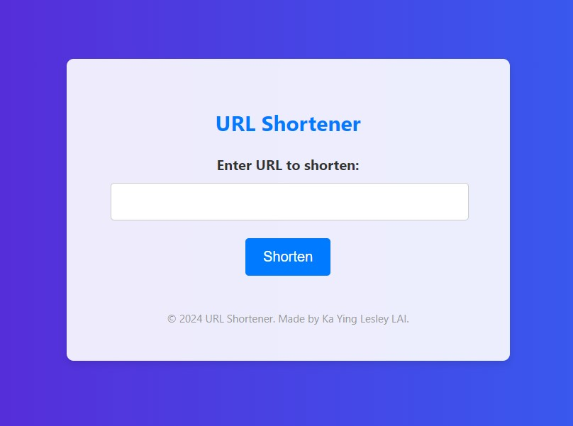
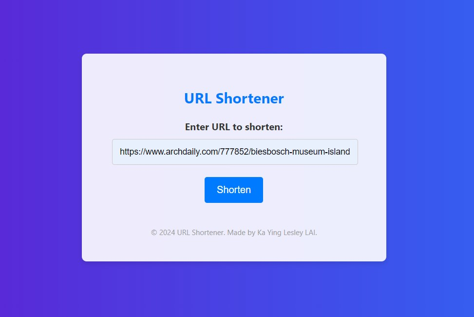
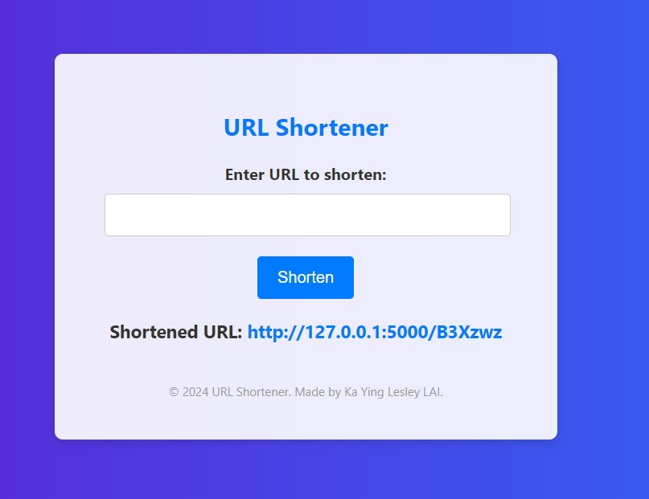

# URL Shortener

A simple web application to shorten long URLs. This project uses Python and Flask for the backend and HTML/CSS for the frontend.

## Features

- Shorten long URLs.
- Redirect shortened URLs to the original URLs.
- Simple and professional user interface.

## Prerequisites

- Python 3.12
- `virtualenv` package (optional but recommended)

## Installation

1. **Clone the repository:**

    ```sh
    git clone https://github.com/kayinglai/url_shortener.git
    cd url_shortener
    ```

2. **Create a virtual environment (optional but recommended):**

    ```sh
    python -m venv venv
    ```

3. **Activate the virtual environment: (Please activate it in CMD on Windows or Terminal on masOS instead of PowerShell.)**

    - On Windows:

        ```sh
        venv\Scripts\activate
        ```

    - On macOS/Linux:

        ```sh
        source venv/bin/activate
        ```

4. **Install the required packages:**

    ```sh
    pip install -r requirements.txt
    ```

## Usage

1. **Run the Flask application:**

    ```sh
    python url_shortener.py
    ```

2. **Open your web browser and go to: (Please note that Live Server Extension is not applicable.)**

    ```
    http://127.0.0.1:5000/
    ```

3. **Use the web interface to shorten URLs.**





## Project Structure

```
url-shortener/
│── Images
  └──url_shortener_001.jpg
  └──url_shortener_002.jpg
  └──url_shortener_003.jpg
  
├── static/
│ └── style.css # CSS file for styling
├── templates/
│ └── index.html # HTML template for the main page
├── url_shortener.py # Main Flask application
├── requirements.txt # List of Python dependencies
└── README.md # This README file
```


## CSS Styling

The application uses a custom CSS file to enhance the user interface with a modern look. The CSS file is located in the `static` directory.

## License

This project is licensed under the MIT License. See the [LICENSE](LICENSE) file for more details.

## Acknowledgments

- [Flask](https://flask.palletsprojects.com/) - The web framework used
- [Python](https://www.python.org/) - The programming language used
- [GitHub](https://github.com/) - Repository hosting

---
